# CS323 Distributed Voting System
### Laboratory Activity 2 | CS323 - Distributed Systems
**Group:** Shonget
**Members:**
- Chiong, Heart
- Limpahan, Mark Vincent
- Locsin, Roxanne
- Mag-isa, Jules
- Sajol, Rhenel Jhon

---

## System Overview

This project implements a Distributed Voting System that simulates an edge-to-cloud architecture. Multiple independent edge nodes generate votes and transmit them to a central API, which queues them for asynchronous processing by a worker service. All data is stored persistently in a Supabase database.

Since GCP required billing, the system was adapted to use Supabase as a free alternative, maintaining the same distributed system principles and architecture defined in the laboratory activity.

The system was designed and tested under both normal and failure conditions to evaluate its reliability, fault tolerance, and consistency as a distributed system.

---

## Architecture

```
Edge Nodes → Flask API → Supabase votes_queue → Worker Service → Supabase votes
```

| Component | Original (GCP) | Our Implementation |
|---|---|---|
| Edge Nodes | Python edge scripts | Python edge scripts |
| Ingestion Layer | Cloud Run API | Local Flask API |
| Message Queue | Google Pub/Sub | Supabase votes_queue table |
| Processing Layer | Cloud Run Worker | Local Python Worker |
| Storage Layer | Firestore | Supabase votes table |

### Component Descriptions

- **Edge Nodes** — Simulate distributed clients that independently generate and transmit votes. Each node has a unique ID, introduces random delays, and includes retry logic for failed transmissions.

- **Flask API** — A lightweight stateless REST API that receives vote data via HTTP POST, validates the payload, and inserts it into the Supabase queue table. This simulates the Cloud Run ingestion layer and Pub/Sub publish step.

- **Supabase votes_queue** — Acts as the message buffer between the API and worker. Votes are inserted with a `pending` status and updated to `processed` after the worker handles them. This simulates Google Pub/Sub behavior.

- **Worker Service** — Continuously polls the queue for pending votes, processes them, and writes the final result to the votes table using an idempotent upsert. This simulates the Cloud Run worker and Firestore write step.

- **Supabase votes** — The final persistent storage layer. Each document is uniquely identified by `user_id_poll_id` to prevent duplicate entries, simulating Firestore's document model.

---

## Architecture Diagram



> *See diagram.png in the repository for the full system flow illustration.*

---

## Setup Instructions

### Requirements
- Python 3.8 or higher
- pip
- Supabase account (free at [supabase.com](https://supabase.com))
- Internet connection

---

### Step 1: Clone the Repository

```bash
git clone https://github.com/[your-group]/cs323-voting-system
cd cs323-voting-system
```

---

### Step 2: Create Virtual Environment

```bash
# Create venv
python -m venv venv

# Activate on Windows
venv\Scripts\activate

# Activate on Mac/Linux
source venv/bin/activate
```

You should see `(venv)` at the start of your terminal line.

---

### Step 3: Install Dependencies

```bash
pip install supabase flask requests
```

---

### Step 4: Set Up Supabase

1. Go to [supabase.com](https://supabase.com) and create a free account
2. Create a new project named `cs323-voting-system`
3. Go to **SQL Editor** and run the following:

```sql
-- Queue table (simulates Pub/Sub)
CREATE TABLE votes_queue (
  id UUID DEFAULT gen_random_uuid() PRIMARY KEY,
  user_id TEXT NOT NULL,
  poll_id TEXT NOT NULL,
  choice TEXT NOT NULL,
  edge_id TEXT,
  timestamp FLOAT,
  time_created FLOAT,
  status TEXT DEFAULT 'pending',
  created_at TIMESTAMPTZ DEFAULT NOW()
);

-- Final votes table (simulates Firestore)
CREATE TABLE votes (
  id TEXT PRIMARY KEY,
  user_id TEXT NOT NULL,
  poll_id TEXT NOT NULL,
  choice TEXT NOT NULL,
  edge_id TEXT,
  timestamp FLOAT,
  time_created FLOAT,
  processed_at TIMESTAMPTZ DEFAULT NOW()
);

-- Disable RLS for both tables
ALTER TABLE votes_queue DISABLE ROW LEVEL SECURITY;
ALTER TABLE votes DISABLE ROW LEVEL SECURITY;

-- Optional cleanup before running the demo again
-- Use this if you want a fresh start and no old rows left in the tables
DELETE FROM votes;
DELETE FROM votes_queue;
```

4. Go to **Project Settings → API** and copy:
   - **Project URL**
   - **Publishable (anon) Key**

---

### Step 5: Add Supabase Credentials

Create a `.env` file in this folder and add your Supabase values:

```env
SUPABASE_URL=https://your-project.supabase.co
SUPABASE_KEY=your-publishable-key
SUPABASE_MOCK=0
```

Both `api_service.py` and `worker_service.py` read these values automatically when they start.

---

### Step 6: Run the System

Open **3 separate terminals**, activate venv in each, then run in this order:

```bash
# Terminal 1 — Start API first
python api_service.py
# Terminal 1 — With Time (60 secs sample)
timeout 60 python api_service.py 2>&1 | tee api_log.txt

# Terminal 2 — Start Worker
python worker_service.py
# Terminal 2 — With Time (60 secs sample)
timeout 60 python -u worker_service.py 2>&1 | tee worker_log.txt

# Terminal 3 — Start Edge Node
python edge_node.py
# Terminal 3 — With Time (60 secs sample)
timeout 60 python -u edge_node.py 2>&1 | tee edge_log.txt

```

If you want a single command instead, run:

```bash
python main.py
```

That starts the API, worker, and edge node together as separate processes.

If you want to test the worker without real Supabase data, run:

```bash
python worker_service.py --mock --once
```

---

### Step 7: Verify the System

1. Go to **Supabase → Table Editor**
2. Open `votes_queue` — you should see votes arriving with status `pending` first, then `processed` after the worker handles them
3. Open `votes` — you should see the final processed vote records being written by the worker service
4. Use the terminal logs from the API, worker, and edge node to confirm the end-to-end flow

---

## Fault Tolerance Tests

### Test 1: Message Duplication
Modified `edge_node.py` to send the same vote twice:
```python
vote = generate_vote()
send_vote(vote)
send_vote(vote)  # intentional duplicate
```
**Result:** The `votes` table still shows only one record per user because of the idempotency key `user_id_poll_id`. Duplicate messages are safely ignored.

---

### Test 2: Worker Failure
Stopped the worker service while edge nodes continued running.

**Observed:**
- Flask API continued accepting votes normally
- `votes_queue` accumulated votes with status `pending`
- `votes` table stopped receiving updates
- No system-wide crash occurred

This demonstrates how the queue isolates failure to a single component.

---

### Test 3: Recovery
Restarted the worker service after the failure period.

**Observed:**
- Worker automatically reconnected and began processing queued messages
- All pending votes were processed in batches
- `votes` table resumed updating without any manual intervention
- No votes were lost during the downtime period

---

## Performance Observations

This is the analysis phase. Use the live terminals and Supabase Table Editor to compare the flow from edge node to API to worker to database.

### Where to do the analysis

- **Terminal 1**: Check the API output to see each vote being accepted and inserted into `votes_queue`
- **Terminal 2**: Check the worker output to see each pending vote being processed and written into `votes`
- **Terminal 3**: Check the edge node output to see how many votes were generated and sent
- **Supabase Table Editor**: Open `votes_queue` and `votes` to count rows and confirm the status changes

### How to do the analysis

1. Run `api_service.py`, `worker_service.py`, and `edge_node.py` in separate terminals.
2. Let the edge node send votes for a short period.
3. Open Supabase Table Editor and compare the row counts in `votes_queue` and `votes`.
4. Compare the terminal logs with the table contents to confirm:
  - how many votes were generated
  - how many were queued
  - how many were processed successfully
5. Record the latency values printed by the worker and use them in your final report.

### What to measure

- Votes generated by the edge node
- Votes accepted by the API
- Votes still pending in `votes_queue`
- Votes processed into `votes`
- Latency printed by the worker

### End-to-End Latency
Latency was measured from `time_created` in the edge node to processing time in the worker.

| Condition | Avg Latency |
|---|---|
| Normal operation | 0.45 seconds (measured average over 60s run) |
| After worker recovery | 0.15 seconds (measured average during batch processing) |

### Throughput
| Layer | Count |
|---|---|
| Votes generated (edge) | 22 |
| Votes queued (votes_queue) | 22 (0 pending at end) |
| Votes processed (votes) | 22 |

---

## Demo


> *See demo.gif in the repository for a live demonstration of the system.*

---

## Individual Reflections

### Chiong, Heart

My part in this activity was working on the edge node scripts and the fault injection testing. Running `edge_node.py` was simple enough, but what I found interesting was that it had no idea what was happening on the other end. It just kept sending votes regardless of whether the worker was up or not. The fault injection phase made this clearer. When I stopped the worker while the edge node was still running, I expected something to break, but the API kept accepting requests and the queue just held everything until the worker came back online and processed it all automatically. I was relieved that nothing was lost.

That experience made me understand more about fault tolerance, experiencing it through hands on was really amazing rather than understanding the concept. I also realized debugging distributed systems is harder than normal especially when something looked off, it wasn't obvious which part was causing it since multiple components are running at the same time. Overall the activity gave me a better appreciation for why systems are designed this way, where each part works independently so one failure doesn't bring everything else down.


---

### Limpahan, Mark Vincent

Running these terminals made distributed systems feel real for me in a way that you can only see when you're actually hands-on doing the lectures discussed. Watching the edge node send votes, the API accept them, and the worker drain the queue  made loose coupling click. I kept refreshing the Supabase Table Editor and seeing rows flip from `pending` to `processed`, and it was a simple thing that actually said a lot about how the system was designed.

The fault tolerance tests were where I learned the most. Seeing the API keep accepting votes without any issue while the worker was down showed me that the queue is not just a convenience. The duplication test was equally surprising because the `votes` table count never changed no matter how many duplicate votes were sent, and the idempotency key handled it completely silently. When the worker came back online and processed everything on its own, it confirmed that recovery does not have to be complicated if the architecture is set up right. The biggest shift in how I think about systems after this activity is that reliability is not about preventing failure, butabout making sure failure stays contained and recoverable. That idea became very concrete here, and I do not think I would have understood it the same way without actually watching it happen in the terminals.

---

### Locsin, Roxanne
During normal operation, I spent most of the time watching the three terminals side by side: edge_node.py, api_service.py, and worker_service.py. It was interesting to see how each component had its own role but still worked together smoothly. The edge node continuously generated votes, the API kept accepting requests with 200 responses, and the worker processed the queued entries one by one. In Supabase, I could actually see the flow happening in real time scuhc as new rows would appear in votes_queue as pending, then after a few seconds they would change to processed and appear in the votes table. Seeing the whole process visually made the system much easier for me to understand.

During the fault injection test, I stopped worker_service.py to see what would happen. At first, I expected the system to break or throw errors, but surprisingly, the edge node and API kept running normally. The votes continued entering the votes_queue table, but they stayed in pending status since there was no worker processing them. What stood out to me most was when I restarted the worker and saw it continue processing the queued votes without losing any data. That moment made me realize how distributed systems are designed to keep operating even if one component temporarily fails.

From this activity, I learned that distributed systems are not just about running multiple programs at once, but about separating responsibilities so the whole system can stay stable under different conditions. Seeing the logs, terminals, and Supabase tables update in real time helped me better understand how each service depends on the others without completely stopping the system when one fails.

---

### Mag-isa, Jules

Though I haven't seen that much other than working on the essays of the reflections or questions, I can say, through some quick skimming, on how I have oberserved with regards to our group's work. While reading some of my group mates' own reflection essays, I read that, in the voting system exercise, three separate terminals of api_service.py, worker_service.py, and edge_node.py even "worked" together even if they have not met each other, as if they have already "knew" each other when they are allinputted with their respective code. Like actual elections counting votes to ensure accuracy and transparent votes, this exercise pends with new rows before being changed as processed by the workers in picking them up. Some votes have 0 votes, while others have at least one vote. 

As per the fellow group mates' reflecctions, I can say that even when suddenly stopped, the API remained working, the edge node never quit, and votes are still visible. Even when "restarted" all over again, they can work without theperson who instructed or saw them, like me, they did their jobs together like one of them does one thing, the second does the other, and so on. It's like they keep going until all of them broke. When one's broken and the others are still good, they push on until taks complete, done collectively until all work's done.  
---

### Sajol, Rhenel Jhon

When I started `api_service.py`, `worker_service.py`, and `edge_node.py` in three separate terminals, I watched how they worked together without needing to know about each other. The `edge_node.py` sent votes every few seconds, and the API accepted them with "POST /vote HTTP/1.1 200" responses. The worker just kept checking the queue by printing messages. When I opened `votes_queue` in Supabase, I saw something interesting happening in real time - new rows appeared with `status='pending'`, and then a few seconds later the status changed to 'processed' as the worker picked them up. The most important observation was after running for 60 seconds, I checked the database and found 22 votes in the `votes` table with 0 rows still pending. Every vote had traveled through the entire system smoothly from `edge_node.py` to `api_service.py` to `votes_queue` to `worker_service.py` and finally to the `votes` table.

The real lesson came when I stopped `worker_service.py` using Ctrl+C while letting `edge_node.py` continue sending votes. For about 15 seconds, the API kept accepting votes normally and they piled up in `votes_queue` with `status='pending'`. What surprised me was that nothing broke - the API did not crash, `edge_node.py` did not give up, and votes did not disappear. Then I restarted the worker by running `worker_service.py` again, and it immediately started processing all those waiting votes without any help from me. Looking at the code in `api_service.py` and `worker_service.py`, I realized they do completely different jobs but they communicate through the same `votes_queue` table using the status column. The API only cares about inserting data, and the worker only cares about reading and updating. Neither one needs to check if the other is working at that exact moment. This separation is what makes the system strong and able to handle problems. If one part breaks, the other keeps working and the queue holds everything safe until the broken part comes back online.


---


## Repository Structure

```
cs323-voting-system/
├── edge_node.py          # Edge node simulation
├── api_service.py        # Flask API (simulates Cloud Run ingestion)
├── worker_service.py     # Worker service (simulates Cloud Run worker)
├── diagram.png           # System architecture diagram
├── demo.gif              # System demo recording
└── README.md             # This file
```

---

## Trade-off Analysis

| Design Decision | Benefit | Trade-off |
|---|---|---|
| Supabase queue as Pub/Sub | Free, no billing needed | Polling adds slight delay vs real Pub/Sub push |
| Idempotent upsert | Prevents duplicate votes | Slight processing overhead per vote |
| Random edge delays | Simulates real distributed behavior | Makes throughput unpredictable |
| Retry logic in edge node | Handles network failures | May cause intentional duplicates during testing |
| Stateless Flask API | Fast, lightweight ingestion | No local processing, fully dependent on Supabase |
